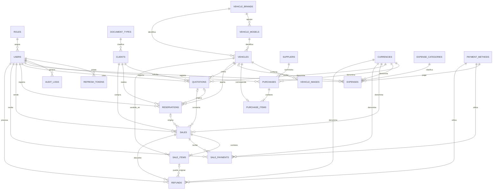

# Base de datos y relaciones de JFM AutoManager

## 1. Objetivo del documento

Este documento describe la estructura funcional de la base de datos de JFM AutoManager y sus relaciones principales. Esta pensado para servir como referencia tecnica y como fuente para generar una imagen del modelo entidad-relacion.

La base de datos utiliza PostgreSQL. Las llaves primarias son UUID y la mayoria de las tablas incluyen `created_at` y `updated_at` para registrar su creacion y ultima modificacion.

Quedan fuera de este documento:

- Las tablas internas utilizadas por Kysely para controlar migraciones.
- El modulo de facturacion electronica y sus entidades fiscales.
- Las vistas de reporte relacionadas exclusivamente con documentos fiscales.

## 2. Organizacion general

La base de datos se divide en los siguientes grupos:

| Grupo | Proposito |
| --- | --- |
| Catalogos | Valores reutilizables como roles, monedas, metodos de pago, marcas y modelos. |
| Seguridad | Usuarios, sesiones y auditoria de operaciones. |
| Personas y empresas | Clientes y proveedores. |
| Inventario | Vehiculos y sus imagenes. |
| Compras | Registro de adquisiciones y costos de importacion de vehiculos. |
| Gastos | Costos generales o asociados a un vehiculo. |
| Ciclo comercial | Cotizaciones, reservas, ventas, pagos y reembolsos. |
| Reportes | Vistas calculadas para consultas gerenciales. |

## 3. Diagrama entidad-relacion

El siguiente bloque puede renderizarse directamente en GitHub, GitLab, Mermaid Live Editor o cualquier herramienta compatible con Mermaid.

### Leyenda de cardinalidades

| Simbolo | Significado |
| --- | --- |
| `||` | Exactamente uno. |
| `o|` | Cero o uno. |
| `o{` | Cero o muchos. |
| `|{` | Uno o muchos. |

## 4. Diccionario de tablas

### 4.1 Catalogos

#### `roles`

Define los perfiles de acceso de los usuarios.

- Llave primaria: `id`.
- Campos principales: `name`, `description`, `is_active`.
- Relacion: un rol puede estar asignado a muchos usuarios.

#### `document_types`

Contiene los tipos de documentos usados para identificar clientes.

- Llave primaria: `id`.
- Campos principales: `name`, `is_active`.
- Relacion: un tipo de documento puede ser usado por muchos clientes.

#### `currencies`

Registra las monedas admitidas por el sistema.

- Llave primaria: `id`.
- Campos principales: `code`, `name`, `symbol`, `is_active`.
- `code` es unico.
- Es utilizada por compras, gastos, cotizaciones, ventas, pagos y reembolsos.

#### `payment_methods`

Define las formas de pago disponibles.

- Llave primaria: `id`.
- Campos principales: `name`, `is_active`.
- Es utilizada por gastos, pagos de ventas y reembolsos.

#### `vehicle_brands`

Catalogo de marcas de vehiculos.

- Llave primaria: `id`.
- Campo principal: `name`, que es unico.
- Relacion: una marca tiene muchos modelos y vehiculos.

#### `vehicle_models`

Catalogo de modelos asociados a una marca.

- Llave primaria: `id`.
- Llave foranea: `brand_id` apunta a `vehicle_brands.id`.
- Campos principales: `name`, `is_active`.
- La combinacion de marca y nombre de modelo es unica.

#### `expense_categories`

Clasifica los gastos del negocio.

- Llave primaria: `id`.
- Campos principales: `name`, `scope`, `is_active`.
- `scope` indica si la categoria es `general` o esta destinada a un `vehicle`.

### 4.2 Seguridad y auditoria

#### `users`

Almacena los usuarios que acceden al sistema.

- Llave primaria: `id`.
- Llave foranea: `role_id` apunta a `roles.id`.
- Campos principales: `first_name`, `last_name`, `email`, `password_hash`, `phone`, `is_active`, `last_login_at`.
- `email` es unico.
- `deleted_at` permite borrado logico sin perder el historial.

#### `refresh_tokens`

Mantiene las sesiones renovables de los usuarios.

- Llave primaria: `id`.
- Llave foranea: `user_id` apunta a `users.id`.
- Campos principales: `token_hash`, `expires_at`, `revoked_at`, `user_agent`, `ip_address`.
- El token se almacena como hash y no en texto claro.
- Si se elimina fisicamente un usuario, sus tokens se eliminan en cascada.

#### `audit_logs`

Conserva el historial de inserciones, modificaciones y eliminaciones auditadas.

- Llave primaria: `id`.
- Llave foranea opcional: `user_id` apunta a `users.id`.
- Campos principales: `table_name`, `record_id`, `action`, `old_data`, `new_data`, `ip_address`.
- Si el usuario deja de existir, el registro de auditoria se conserva con `user_id` en `NULL`.

### 4.3 Clientes y proveedores

#### `clients`

Almacena personas o empresas que participan en el ciclo comercial.

- Llave primaria: `id`.
- Llave foranea: `document_type_id` apunta a `document_types.id`.
- Campos principales: `client_type`, `document_number`, nombres personales o `company_name`, `email`, `phone`, `address`, `city`.
- La combinacion de tipo y numero de documento es unica.
- Se relaciona con cotizaciones, reservas y ventas.
- Utiliza borrado logico mediante `deleted_at`.

#### `suppliers`

Registra las empresas o personas que suministran vehiculos.

- Llave primaria: `id`.
- Campos principales: `name`, `contact_name`, `document_number`, `email`, `phone`, `address`, `country`.
- Relacion: un proveedor puede tener muchas compras.
- Utiliza borrado logico mediante `deleted_at`.

### 4.4 Inventario

#### `vehicles`

Es la entidad central del inventario automotriz.

- Llave primaria: `id`.
- Llaves foraneas: `brand_id` y `model_id`.
- Campos principales: `year`, `chassis_number`, `color`, `mileage`, `engine_number`, `transmission_type`, `fuel_type`, `sale_price`, `status`, `notes`.
- `chassis_number` es unico.
- Estados posibles: en transito, en inventario, reservado, vendido, en reparacion o no disponible.
- Se relaciona con imagenes, compras, gastos, cotizaciones, reservas y partidas de venta.
- Utiliza borrado logico mediante `deleted_at`.

#### `vehicle_images`

Contiene las imagenes asociadas a cada vehiculo.

- Llave primaria: `id`.
- Llave foranea: `vehicle_id` apunta a `vehicles.id`.
- Campos principales: `url`, `is_primary`.
- Si el vehiculo se elimina fisicamente, sus imagenes se eliminan en cascada.

### 4.5 Compras e importaciones

#### `purchases`

Representa la cabecera de una adquisicion realizada a un proveedor.

- Llave primaria: `id`.
- Llaves foraneas: `supplier_id`, `currency_id`, `created_by`.
- Campos principales: `purchase_number`, `invoice_number`, `purchase_date`, `exchange_rate`, `status`, `notes`.
- `purchase_number` es unico.
- `invoice_number` es una referencia del documento recibido del proveedor y pertenece al proceso de compra.
- Estados posibles: pendiente, en transito, recibida o cancelada.
- Utiliza borrado logico mediante `deleted_at`.

#### `purchase_items`

Detalla los vehiculos incluidos en una compra y su costo de importacion.

- Llave primaria: `id`.
- Llaves foraneas: `purchase_id` y `vehicle_id`.
- Campos principales: `unit_cost`, `freight_cost`, `insurance_cost`, `other_costs`.
- Cada vehiculo puede pertenecer como maximo a una partida de compra.
- Si una compra se elimina fisicamente, sus partidas se eliminan en cascada.

### 4.6 Gastos

#### `expenses`

Registra desembolsos generales o vinculados a un vehiculo.

- Llave primaria: `id`.
- Llaves foraneas: `category_id`, `vehicle_id` opcional, `currency_id`, `payment_method_id`, `created_by`.
- Campos principales: `description`, `amount`, `exchange_rate`, `expense_date`.
- `amount` debe ser mayor que cero y `exchange_rate` debe ser positivo.
- Cuando `vehicle_id` tiene valor, el gasto forma parte del costo real de ese vehiculo.
- Utiliza borrado logico mediante `deleted_at`.

### 4.7 Ciclo comercial

#### `quotations`

Registra una oferta de venta de un vehiculo a un cliente.

- Llave primaria: `id`.
- Llaves foraneas: `client_id`, `vehicle_id`, `currency_id`, `created_by`.
- Campos principales: `quotation_number`, `quoted_price`, `valid_until`, `status`, `notes`.
- `quotation_number` es unico.
- Estados posibles: pendiente, aprobada, rechazada, vencida o convertida.
- Puede dar origen a una o varias reservas historicas.

#### `reservations`

Representa el apartado temporal de un vehiculo para un cliente.

- Llave primaria: `id`.
- Llaves foraneas: `quotation_id` opcional, `client_id`, `vehicle_id`, `created_by`.
- Campos principales: `reservation_number`, `deposit_amount`, `reservation_date`, `expiration_date`, `status`.
- `reservation_number` es unico.
- Estados posibles: activa, vencida, convertida o cancelada.
- Puede dar origen a ventas; si se elimina la cotizacion vinculada, la reserva se conserva.

#### `sales`

Es la cabecera de una operacion de venta. Los vehiculos y sus precios se almacenan en `sale_items`.

- Llave primaria: `id`.
- Llaves foraneas: `reservation_id` opcional, `quotation_id` opcional, `client_id`, `currency_id`, `salesperson_id`.
- Campos principales: `sale_number`, `exchange_rate`, `sale_date`, `status`.
- `sale_number` es unico.
- Estados posibles: en proceso, completada o cancelada.
- Una venta puede contener varios vehiculos, pagos y reembolsos.
- Utiliza borrado logico mediante `deleted_at`.

#### `sale_items`

Contiene los vehiculos vendidos y el precio acordado para cada unidad.

- Llave primaria: `id`.
- Llaves foraneas: `sale_id` y `vehicle_id`.
- Campos principales: `sale_price`, `status`, `returned_at`, `return_reason`.
- Estados posibles: activa o devuelta.
- Un vehiculo solo puede aparecer en una partida de venta activa a la vez.
- Si la partida esta devuelta, la fecha y el motivo de devolucion son obligatorios.

#### `sale_payments`

Registra el dinero recibido para una venta.

- Llave primaria: `id`.
- Llaves foraneas: `sale_id`, `payment_method_id`, `currency_id`, `received_by`.
- Campos principales: `amount`, `payment_date`, `reference_number`.
- `amount` debe ser mayor que cero.
- Si una venta se elimina fisicamente, sus pagos se eliminan en cascada.

#### `refunds`

Registra dinero devuelto al cliente.

- Llave primaria: `id`.
- Llaves foraneas: `sale_id`, `sale_item_id` opcional, `refund_method_id`, `currency_id`, `processed_by`.
- Campos principales: `amount`, `exchange_rate`, `refund_date`, `reason`.
- Un reembolso puede corresponder a toda la venta o a una unidad especifica.
- Se mantiene separado de los pagos para conservar claramente cuanto dinero entro y cuanto salio.

## 5. Relaciones principales resumidas

| Origen | Destino | Cardinalidad | Descripcion |
| --- | --- | --- | --- |
| `roles` | `users` | 1:N | Un rol agrupa muchos usuarios. |
| `vehicle_brands` | `vehicle_models` | 1:N | Una marca contiene muchos modelos. |
| `vehicles` | `vehicle_images` | 1:N | Un vehiculo puede tener varias imagenes. |
| `suppliers` | `purchases` | 1:N | Un proveedor participa en muchas compras. |
| `purchases` | `purchase_items` | 1:N | Una compra contiene uno o mas vehiculos. |
| `vehicles` | `purchase_items` | 1:0..1 | Un vehiculo pertenece como maximo a una compra. |
| `vehicles` | `expenses` | 1:N opcional | Un vehiculo puede acumular varios gastos. |
| `clients` | `quotations` | 1:N | Un cliente puede solicitar varias cotizaciones. |
| `quotations` | `reservations` | 1:N opcional | Una reserva puede nacer de una cotizacion. |
| `reservations` | `sales` | 1:N opcional | Una venta puede nacer de una reserva. |
| `clients` | `sales` | 1:N | Un cliente puede realizar varias compras. |
| `sales` | `sale_items` | 1:N | Una venta contiene uno o mas vehiculos. |
| `vehicles` | `sale_items` | 1:N historico | Un vehiculo puede reaparecer tras una devolucion, pero solo una linea puede estar activa. |
| `sales` | `sale_payments` | 1:N | Una venta puede ser pagada en varios movimientos. |
| `sales` | `refunds` | 1:N | Una venta puede tener varios reembolsos. |
| `sale_items` | `refunds` | 1:N opcional | Un reembolso puede asociarse a una unidad devuelta. |

## 6. Reglas de integridad importantes

- Los identificadores usan UUID generados por PostgreSQL.
- Los importes monetarios se almacenan con precision decimal y no como numeros flotantes.
- Los campos `exchange_rate` permiten convertir operaciones a una moneda comun de reporte.
- El numero de chasis de un vehiculo es unico.
- Un vehiculo solo puede pertenecer a una partida de compra.
- Un vehiculo no puede estar simultaneamente en dos partidas de venta activas.
- Las eliminaciones de clientes, proveedores, vehiculos, compras, gastos, cotizaciones, reservas, ventas y usuarios son normalmente logicas mediante `deleted_at`.
- Las relaciones historicas importantes usan `ON DELETE RESTRICT` para evitar la perdida accidental de trazabilidad.
- Los datos dependientes sin valor historico propio, como imagenes y tokens de sesion, usan `ON DELETE CASCADE`.
- Las referencias opcionales a cotizaciones y reservas usan `ON DELETE SET NULL`, por lo que la operacion posterior se conserva aunque se retire el registro de origen.
- `updated_at` se actualiza automaticamente mediante triggers de PostgreSQL.

## 7. Tipos enumerados utilizados

| Tipo | Valores funcionales |
| --- | --- |
| Tipo de cliente | Individual, empresa. |
| Estado del vehiculo | En transito, en inventario, reservado, vendido, en reparacion, no disponible. |
| Estado de compra | Pendiente, en transito, recibida, cancelada. |
| Estado de cotizacion | Pendiente, aprobada, rechazada, vencida, convertida. |
| Estado de reserva | Activa, vencida, convertida, cancelada. |
| Estado de venta | En proceso, completada, cancelada. |
| Estado de partida de venta | Activa, devuelta. |
| Alcance de gasto | General, vehiculo. |
| Accion de auditoria | Insercion, actualizacion, eliminacion. |

## 8. Vistas de reporte no fiscales

Las vistas son consultas de solo lectura y normalmente no se representan como entidades principales en un diagrama ER. El sistema mantiene las siguientes vistas no fiscales:

| Vista | Informacion que presenta |
| --- | --- |
| `vw_sale_totals` | Total vigente y total historico de las partidas de cada venta. |
| `vw_vehicle_profitability` | Costo de compra, gastos, precio vendido y margen por vehiculo. |
| `vw_accounts_receivable` | Total vendido, pagado, reembolsado y saldo pendiente por venta. |
| `vw_sales_summary_monthly` | Cantidad de ventas, vehiculos e importes completados por mes. |
| `vw_sales_by_salesperson` | Resultados mensuales agrupados por vendedor. |
| `vw_returns_summary_monthly` | Unidades devueltas y valores reembolsados por mes. |
| `vw_expenses_summary_monthly` | Gastos mensuales por categoria y moneda. |
| `vw_inventory_status_summary` | Cantidad de vehiculos agrupados por estado. |

## 9. Flujo relacional del negocio

El flujo principal comienza con el registro de un proveedor y una compra. Cada partida de compra incorpora un vehiculo al inventario y conserva sus costos de adquisicion, transporte, seguro y otros cargos.

Durante su permanencia en inventario, el vehiculo puede acumular gastos. Posteriormente puede ser cotizado a un cliente, reservado y finalmente incluido en una venta. La venta puede agrupar varios vehiculos, recibir varios pagos y registrar reembolsos generales o asociados a una unidad devuelta.

Esta estructura permite calcular la rentabilidad real por vehiculo, el saldo pendiente de cada venta, el rendimiento de los vendedores y el estado actual del inventario sin perder el historial de operaciones.
